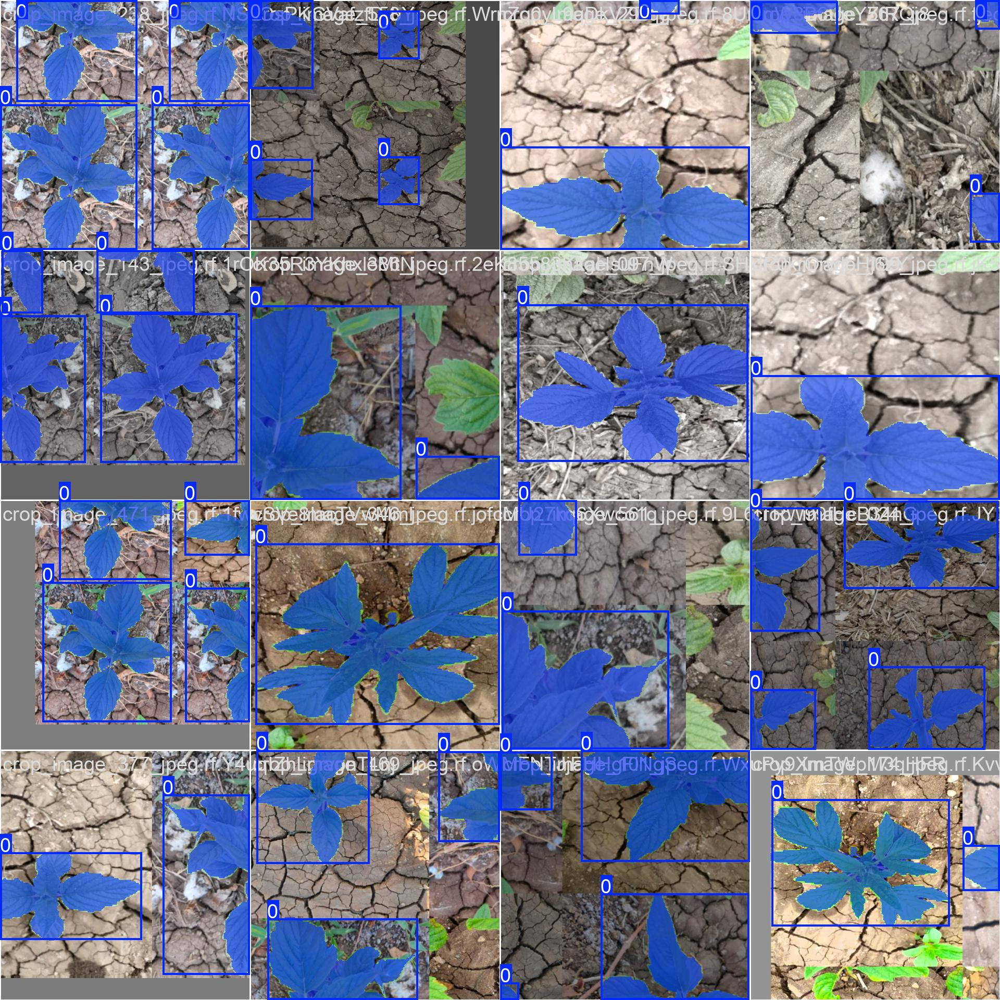
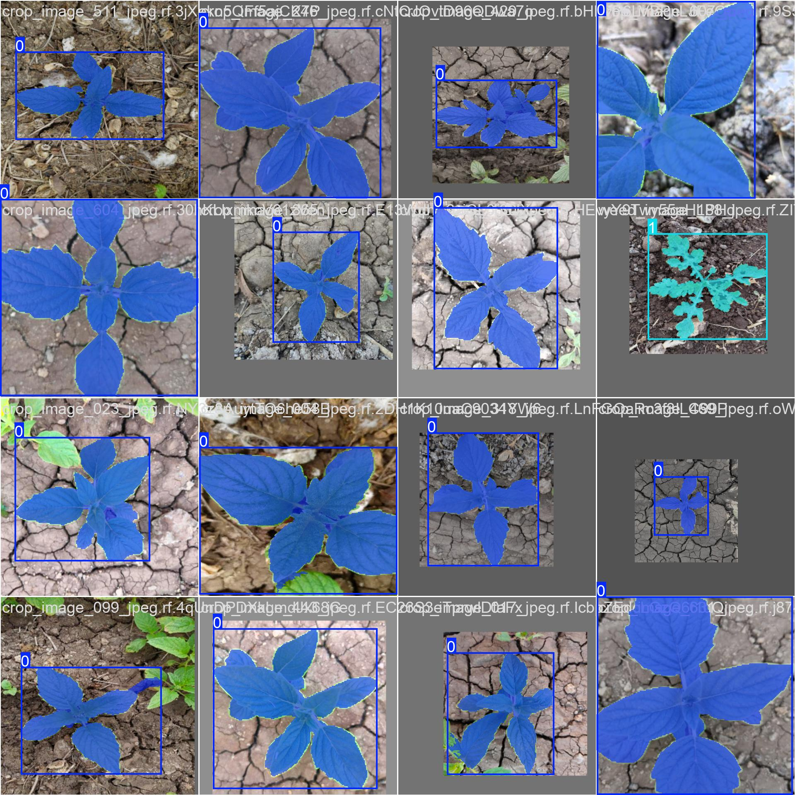
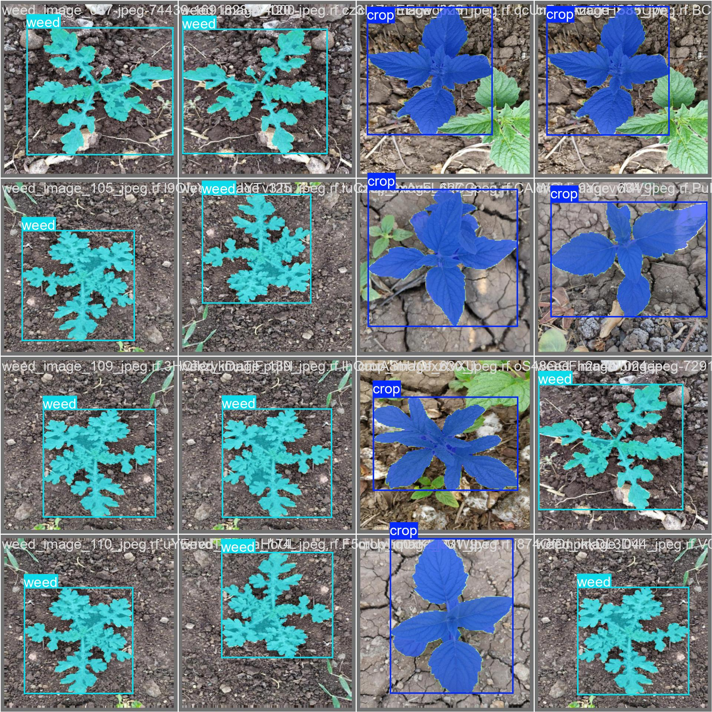
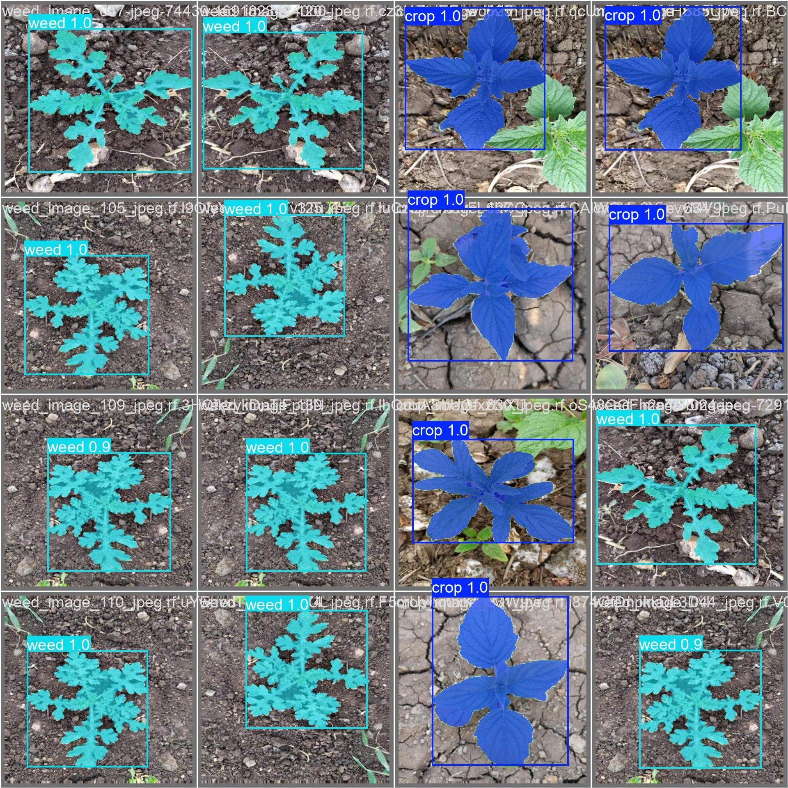

# Weed Detection System — ESP32 LED Indicator

A precision agriculture system that detects weeds and crops in real time using a deep learning segmentation model and signals the result via an ESP32-controlled LED system.

## Authors

- **Amos Maru**
- **Paul**


## Literature Review

### The 4 Principles of Computer Vision

Computer vision is the field of artificial intelligence that enables machines to interpret and understand visual information from the world. This project applies all four core principles:

**1. Image Acquisition**
The process of capturing visual data from the real world using a camera or sensor. In this project, raw images of bean crops and weeds were captured in the field using a phone camera, and live frames are captured during real-time detection using a webcam.

**2. Image Processing**
Cleaning and preparing the image for analysis — including resizing, normalization, noise removal, and augmentation. In this project, Roboflow handled image transformation and augmentation (flips, brightness adjustments, blur) before training, and the model applies preprocessing (resize to 640×640, normalization) during inference.

**3. Feature Extraction**
Identifying meaningful patterns, edges, shapes, and textures in the image. In this project, each image was manually annotated on Roboflow by drawing polygon masks around individual plants — tracing the exact leaf shape, boundary, and structure. This taught the model what visual features separate a crop from a weed, such as leaf shape, size, and growth pattern.

**4. Interpretation and Decision Making**
Using the extracted features to understand what is in the image and take action. In this project, the model classifies each detected plant as either crop (class 0) or weed (class 1), and the result triggers a physical response — blinking the red or green LED on the ESP32.


## Step 1 — Data Collection

Raw images were collected in the field — photographs of **bean crops** and **weeds** taken at close range using a phone camera.

Images were organized into two folders:

```
raw images/
├── beans/     → 118 raw crop images (image_001.jpeg ... image_118.jpeg)
└── weed1/     →  27 raw weed images (image_002.jpeg ... image_412.jpeg)
```

Sample raw crop image:


Sample raw weed image:


## Step 2 — Annotation using Roboflow

Each image was uploaded to **Roboflow** and annotated **one image at a time** by drawing polygon masks around each plant.

### Annotation Process

1. Upload image to Roboflow project
2. Select the **Polygon tool**
3. Carefully trace around each plant — crop or weed
4. Assign the correct class label: `crop` or `weed`
5. Save and move to the next image
6. Repeat for every single image in the dataset

### Classes defined

| Class ID | Name | Description |
|----------|------|-------------|
| 0 | crop | Bean plants |
| 1 | weed | Unwanted plants |

The annotation produces a **segmentation mask** for each plant — not just a bounding box — so the model learns the exact shape of each plant.

### Roboflow Annotation Screenshot

> Annotation was done on the Roboflow platform. Each image was opened, polygons were drawn around each plant, and a class label was assigned before moving to the next image.


## Step 3 — Image Transformation and Augmentation

After annotation, Roboflow applied **automatic augmentations** to increase dataset size and improve model robustness:

- Brightness and contrast adjustments
- Blur and noise

The exported dataset follows a standard object detection format:

```
traning images/
├── crops/
│   └── train/    → Augmented crop images + labels (.jpeg + .json)
└── weed/
    └── train/    → Augmented weed images + labels (.jpeg + .json)
```

Each exported image filename contains a Roboflow hash (e.g. `image_001_jpeg.rf.PvwTUI0HOwIUGEy9ewWd.jpeg`) confirming it passed through Roboflow's transformation pipeline.

### Sample Training Batch (Early Epoch)



### Sample Training Batch (Late Epoch)




## Step 4 — Training on Google Colab

The model was trained on **Google Colab** using a GPU runtime.

### Notebook

File: `weed_segmentation_yolov8 (3).ipynb`

### Training Configuration

| Parameter | Value |
|-----------|-------|
| Model | Nano segmentation model |
| Epochs | 100 |
| Batch size | 16 |
| Image size | 640×640 |
| Optimizer | Adam |
| Learning rate | Auto (cosine decay) |
| Device | GPU (Google Colab) |

### Training Steps in Colab

1. Mount Google Drive
2. Install required libraries
3. Load dataset from Drive
4. Train the segmentation model
5. Export best weights (`best.pt`) back to Drive
6. Download to local machine


### Validation — Ground Truth vs Predictions

**Ground Truth:**



**Model Predictions:**




## Step 5 — Real-Time Detection (`run_camera.py`)

The trained `best.pt` model runs on a live webcam feed and detects crops and weeds in real time.

```bash
python run_camera.py
```

- Green overlay = Crop detected
- Red overlay = Weed detected
- Press `q` to quit, `s` to save screenshot


## Step 6 — ESP32 Hardware LED Signal

When the model detects a plant, it sends a serial command to the **ESP32** which blinks an LED:

| Detection | Serial Command | LED | Blinks |
|-----------|---------------|-----|--------|
| Weed | `W` | Red LED (GPIO2) | 3 times |
| Crop | `C` | Green LED (GPIO4) | 2 times |

### ESP32 Wiring

```
ESP32 placement: left pins column b, right pins column i, rows 1–19

GPIO2 (b5) → wire a5 → h30 → Resistor i30–i32 → Red LED h32(+) h34(−) → wire j34 → GND a13
GPIO4 (b7) → wire a7 → h36 → Resistor i36–i38 → Green LED h38(+) h40(−) → wire j40 → GND a19
```

### Arduino Code

File: `esp32_led_blink/esp32_led_blink.ino`

```cpp
#define RED_LED   2
#define GREEN_LED 4

// W received → Red LED blinks 3x  (Weed)
// C received → Green LED blinks 2x (Crop)
```


## Test Images

The `test image/` folder contains sample images to test the model:

```
test image/
├── crop_01.jpeg – crop_05.jpeg   (5 crop samples)
└── weed_01.jpg  – weed_05.jpeg  (5 weed samples)
```


## Project Structure

```
final_5th_project/
├── run_camera.py
├── esp32_led_blink/
│   └── esp32_led_blink.ino
├── model_results/
│   └── weed_segmentation/
│       ├── best.pt
│       ├── results.png
│       ├── confusion_matrix_normalized.png
│       └── ...
├── raw images/
│   ├── beans/
│   └── weed1/
├── traning images/
│   ├── crops/
│   └── weed/
├── test image/
├── screenshots/
└── weed_segmentation_yolov8 (3).ipynb
```


## Dependencies

```bash
pip install ultralytics opencv-python pyserial numpy
```


## License

MIT License
